# AI 视频制作平台 — 产品需求文档 (PRD)

| 项目 | 内容 |
|---|---|
| 文档版本 | v1.0 |
| 创建日期 | 2026-05-15 |
| 编写人 | 产品团队 |
| 状态 | 草案 |

---

## 修订记录

| 版本 | 日期 | 修订内容 | 修订人 |
|---|---|---|---|
| v1.0 | 2026-05-15 | 初始版本：基于 2026-05-15 会议决议，确定四阶段核心流程与交付机制 | 产品团队 |

---

## 1. 项目背景

### 1.1 市场现状

当前市面上的 AI 视频生成工具（如即梦、小云雀、无线画布等）功能日趋完善，但普遍存在以下痛点：

- **价格偏高**：部分工具通过中转平台调用官方 API，导致用户实际支付成本高于官方定价。
- **流程黑盒**：用户无法掌控内容生成的中间环节，难以对人物一致性、分镜连贯性进行干预。
- **创作门槛**：现有流程化工具操作复杂，对非专业用户不够友好。

### 1.2 产品契机

打造一款**流程透明、成本可控、支持逐环节干预**的 AI 短视频生成平台，面向短剧创作者、自媒体运营者等群体，提供从剧本到成片的端到端解决方案。

---

## 2. 产品定位与目标

### 2.1 产品定位

一款面向 AI 短剧/短视频创作的 **SaaS 工具**，核心特色为：

- **分阶段锁定**：每个创作阶段完成后需用户确认锁定，方可进入下一阶段。
- **血缘追踪**：基于资产-分镜-视频的依赖关系图谱，实现精准的局部刷新与回退。
- **剪辑友好交付**：最终输出按剧情顺序命名并附带场记单，直接对接剪映/PR 后期流程。

### 2.2 核心目标

| 目标 | 说明 |
|---|---|
| **成本可控** | 直接对接即梦等官方 API，绕开中转平台，降低调用成本 |
| **质量可控** | 每个阶段支持用户逐条审核、循环迭代，不满意可即时调整 |
| **效率优化** | 交付物天然适配后期剪辑软件，减少人工整理与对齐成本 |
| **进度保护** | 跨阶段回退时，仅解除关联项锁定，无关联进度完美保留 |

---

## 3. 核心流程概览

产品核心流程分为 **三个创作阶段** 与 **一个交付打包阶段**。用户必须逐阶段完成并确认后，方可推进至下一阶段。

```mermaid
graph TD
    classDef default fill:#f9f9fa,stroke:#333,stroke-width:1px;
    classDef stage fill:#e3f2fd,stroke:#1565c0,stroke-width:2px;
    classDef userAction fill:#e8f5e9,stroke:#2e7d32,stroke-width:1px;
    classDef systemAction fill:#fff3e0,stroke:#ef6c00,stroke-width:1px;
    classDef decision fill:#fff9c4,stroke:#fbc02d,stroke-width:2px;
    classDef revert stroke:#c62828,stroke-width:2px,stroke-dasharray: 5 5, fill:#ffebee;
    classDef finish fill:#d1c4e9,stroke:#512da8,stroke-width:2px;
    classDef highlight fill:#fff3e0,stroke:#e65100,stroke-width:2px;

    StartNode(["开始项目: 用户上传剧本"]) --> S1_Split

    %% ================= 阶段一 =================
    subgraph Stage1 ["阶段一：基础资产图生成"]
        S1_Split["内置提示词拆分剧本: 人物/环境/物品"]:::systemAction --> S1_Config["选择AI模型 / 调整提示词"]:::userAction
        S1_Config --> S1_Gen["生成基础资产图"]:::systemAction
        S1_Gen --> S1_Check{"单张资产图<br/>是否满意?"}:::decision
        
        S1_Check -->|"不满意<br/>(换模型/改词)"| S1_Config
        S1_Check -->|"满意"| S1_Lock["锁定资产图并入库"]:::systemAction
        S1_Lock --> S1_AllDone{"所需资产<br/>是否全部锁定?"}:::decision
        
        S1_AllDone -->|"否"| S1_Config
        S1_AllDone -->|"是"| S1_Confirm{"用户确认<br/>进入阶段二?"}:::decision
    end

    S1_Confirm -->|"同意"| S2_Init

    %% ================= 阶段二 =================
    subgraph Stage2 ["阶段二：分镜提示板生成"]
        S2_Init["进入新页面<br/>主区:分镜框 / 右侧:资产折叠页"]:::systemAction --> S2_Split["内置提示词拆分剧本<br/>生成分镜提示词"]:::systemAction
        S2_Split --> S2_Combine["用户拖拽右侧资产图<br/>至左侧分镜框结合"]:::userAction
        S2_Combine --> S2_Config["选择AI模型 / 设定单镜时长<br/>查看并修改提示词"]:::userAction
        S2_Config --> S2_Gen["利用资产图+分镜词<br/>生成分镜提示板图片"]:::systemAction
        S2_Gen --> S2_Check{"该分镜图<br/>是否合格?"}:::decision
        
        S2_Check -->|"不合格<br/>(微调词/换资产)"| S2_Config
        
        S2_Check -->|"合格"| S2_Lock["锁定分镜图"]:::systemAction
        S2_Lock --> S2_AllDone2{"所有分镜图<br/>是否全部锁定?"}:::decision
        
        S2_AllDone2 -->|"否"| S2_Combine
        S2_AllDone2 -->|"是"| S2_Confirm{"用户确认<br/>进入阶段三?"}:::decision
    end

    S2_Confirm -->|"同意"| S3_Init

    %% ================= 阶段三 =================
    subgraph Stage3 ["阶段三：视频素材生成与轻后期"]
        S3_Init["主页面:分镜图 / 右侧:资产折叠页"]:::systemAction --> S3_Combine["结合三要素:<br/>阶段三内置词+一阶段资产+二阶段分镜"]:::systemAction
        S3_Combine --> S3_Config["选择视频AI模型<br/>设定时长 4-15s / 清晰度等接口"]:::userAction
        S3_Config --> S3_Gen["生成动态视频片段"]:::systemAction
        S3_Gen --> S3_Process["播放器: 观看/下载/放大<br/>轻后期: 修改清晰度/滤镜等"]:::userAction
        S3_Process --> S3_Check{"该视频片段<br/>是否满意?"}:::decision
        
        S3_Check -->|"不满意<br/>(改参数/提示词)"| S3_Config
        
        S3_Check -->|"满意"| S3_Lock["锁定视频片段"]:::systemAction
        S3_Lock --> S3_AllDone3{"所有片段<br/>是否全部锁定?"}:::decision
        
        S3_AllDone3 -->|"否"| S3_Combine
        S3_AllDone3 -->|"是"| Delivery_Init
    end

    %% ================= 交付打包模块 =================
    subgraph Delivery ["交付打包阶段 (专为后期剪辑优化)"]
        Delivery_Init["后台执行重命名脚本<br/>严格按剧本顺位命名<br/>例: 01_镜头1_男主走入_5s.mp4"]:::highlight --> Delivery_Doc["解析后台剧本JSON<br/>生成《剪辑场记单.txt》<br/>映射: 序号-时长-原始剧本台词"]:::highlight
        Delivery_Doc --> Delivery_Zip["一键打包ZIP素材包并提供下载"]:::systemAction
    end

    Delivery_Zip --> EndNode(["项目交付: 解压后全选拖入 剪映/PR<br/>素材天然按剧情顺序排列<br/>对照场记单高效配音与加字幕"]):::finish

    %% ================= 全局撤回 / 智能局部刷新 =================
    GlobalRollback(("全局任意门机制<br/>随时跨阶段退回重做")):::revert
    SmartRefresh["智能局部刷新引擎:<br/>精准识别血缘依赖图谱<br/>仅将包含被修改要素的镜头解除锁定<br/>无关联镜头完美保留进度"]:::highlight
    
    %% 反悔/错误触发点
    S1_Confirm -.->|"交接反悔撤回"| GlobalRollback
    S2_Confirm -.->|"交接反悔撤回"| GlobalRollback
    S2_Check -.->|"发现底层资产特征错误"| GlobalRollback
    S3_Check -.->|"发现基础分镜或资产变形"| GlobalRollback
    
    %% 回溯落点
    GlobalRollback --> SmartRefresh
    SmartRefresh -.->|"【仅解锁牵连项】重新调整该分镜要素"| S2_Combine
    SmartRefresh -.->|"【仅解锁牵连项】彻底回炉修改基础资产"| S1_Config
```



---

## 4. 功能需求

### 4.1 阶段一：基础资产图生成

#### 4.1.1 功能概述

用户上传剧本后，系统通过内置提示词自动拆分剧本要素，生成人物、环境、物品等基础资产图。用户需逐张审核并锁定，全部锁定后方可进入阶段二。

#### 4.1.2 用户旅程

| 步骤 | 动作方 | 动作描述 | 输入/输出 |
|---|---|---|---|
| 1 | 用户 | 上传剧本（支持 TXT、PDF、Word 等格式） | 输入：原始剧本文本 |
| 2 | 系统 | 内置提示词解析剧本，自动拆分为人物、环境、物品等要素标签 | 输出：结构化资产清单 |
| 3 | 用户 | 选择 AI 图像生成模型（如即梦、SD 等），调整提示词 | 输入：模型选择 + 自定义提示词 |
| 4 | 系统 | 调用图像生成 API，输出基础资产图 | 输出：单张资产图 |
| 5 | 用户 | 对单张资产图进行评价 | 操作：满意 / 不满意 |
| 6 | 系统 | 若满意则锁定该资产图并存入资产库；若不满意则返回步骤 3 | 状态变更：锁定 / 待修改 |
| 7 | 系统 | 检测是否所有必需资产均已锁定 | 校验：资产完整性检查 |
| 8 | 用户 | 确认进入阶段二 | 操作：同意 / 继续调整 |

#### 4.1.3 关键规则

- **资产类型**：至少支持人物（主角、配角）、环境（室内、室外）、物品（道具）三类。
- **锁定机制**：单张资产图未锁定时，允许无限次修改提示词或切换模型重新生成；一旦锁定，该资产在阶段二变为只读（除非触发全局回退）。
- **完整性校验**：系统需识别剧本中重复出现的人物/场景，避免重复生成相同资产。

---

### 4.2 阶段二：分镜提示板生成

#### 4.2.1 功能概述

基于阶段一锁定的资产图与原始剧本，系统生成分镜提示词。用户通过拖拽方式将资产图与分镜框结合，调整参数后生成分镜提示板图片。逐张审核锁定后进入阶段三。

#### 4.2.2 用户旅程

| 步骤 | 动作方 | 动作描述 | 输入/输出 |
|---|---|---|---|
| 1 | 系统 | 进入分镜编辑页面，左侧为主区分镜框，右侧为阶段一资产折叠面板 | 输出：分镜编辑界面 |
| 2 | 系统 | 内置提示词拆分剧本，自动生成初始分镜提示词 | 输出：分镜列表 + 提示词草稿 |
| 3 | 用户 | 从右侧资产面板拖拽对应资产图至左侧分镜框进行结合 | 操作：拖拽关联 |
| 4 | 用户 | 选择 AI 模型、设定单镜时长、查看并修改分镜提示词 | 输入：模型 + 时长 + 提示词 |
| 5 | 系统 | 结合资产图与分镜提示词，调用图像生成 API 输出分镜提示板图片 | 输出：单张分镜图 |
| 6 | 用户 | 评估分镜图是否合格 | 操作：合格 / 不合格 |
| 7 | 系统 | 若合格则锁定；若不合格则返回步骤 4（微调提示词或更换资产） | 状态变更：锁定 / 待修改 |
| 8 | 系统 | 检测是否所有分镜图均已锁定 | 校验：分镜完整性检查 |
| 9 | 用户 | 确认进入阶段三 | 操作：同意 / 继续调整 |

#### 4.2.3 关键规则

- **分镜框设计**：每个分镜框需清晰展示该镜涉及的资产缩略图、提示词摘要、预计时长。
- **资产复用**：同一资产可在多个分镜中复用，但需建立关联关系以供血缘追踪。
- **单镜时长**：此处设定的时长为阶段三视频生成的参考参数，需支持 4-15 秒范围的预设。

---

### 4.3 阶段三：视频素材生成与轻后期

#### 4.3.1 功能概述

将阶段一的基础资产、阶段二的分镜图与分镜提示词，结合阶段三内置提示词，输入视频生成模型生成动态视频片段。支持轻量级后期处理（清晰度、滤镜），逐条审核锁定后进入交付打包阶段。

#### 4.3.2 用户旅程

| 步骤 | 动作方 | 动作描述 | 输入/输出 |
|---|---|---|---|
| 1 | 系统 | 进入视频生成页面，主区展示分镜图，右侧展示关联资产 | 输出：视频编辑界面 |
| 2 | 系统 | 自动组合三要素：阶段三内置提示词 + 阶段一资产 + 阶段二分镜 | 输出：视频生成参数包 |
| 3 | 用户 | 选择视频 AI 模型、设定时长（4-15s）、清晰度等接口参数 | 输入：模型 + 时长 + 画质 |
| 4 | 系统 | 调用视频生成 API，输出动态视频片段 | 输出：单条视频片段 |
| 5 | 用户 | 在播放器内观看、下载、放大视频；进行轻后期处理（修改清晰度、滤镜等） | 操作：播放 + 后期调整 |
| 6 | 用户 | 评估视频片段是否满意 | 操作：满意 / 不满意 |
| 7 | 系统 | 若满意则锁定；若不满意则返回步骤 3（改参数或提示词），或返回阶段二调整分镜 | 状态变更：锁定 / 待修改 |
| 8 | 系统 | 检测是否所有视频片段均已锁定 | 校验：视频完整性检查 |
| 9 | 系统 | 全部锁定后自动进入交付打包阶段 | 流程推进 |

#### 4.3.3 关键规则

- **视频参数**：时长严格限制在 4-15 秒区间；清晰度至少支持 720p、1080p 两档。
- **轻后期范围**：仅限清晰度调整与基础滤镜（亮度、对比度、色调），不涉及剪辑、转场、字幕等复杂后期（此类操作留给专业剪辑软件）。
- **回退入口**：在步骤 6 若发现基础分镜或资产变形，需支持一键触发全局回退至阶段一或阶段二。

---

### 4.4 阶段四：交付打包阶段

#### 4.4.1 功能概述

专为后期剪辑软件（剪映、Premiere 等）优化的交付流程。系统自动重命名素材、生成剪辑场记单，并打包为 ZIP 供用户下载。

#### 4.4.2 用户旅程

| 步骤 | 动作方 | 动作描述 | 输入/输出 |
|---|---|---|---|
| 1 | 系统 | 执行重命名脚本，按剧本顺位统一命名所有视频片段 | 输出：规范命名文件 |
| 2 | 系统 | 解析后台剧本 JSON，生成《剪辑场记单.txt》 | 输出：场记单文档 |
| 3 | 系统 | 一键打包为 ZIP 素材包 | 输出：ZIP 文件 |
| 4 | 用户 | 下载 ZIP 包，解压后拖入剪映/PR | 操作：下载 + 导入 |

#### 4.4.3 交付规范

**文件命名规则**：
```
{序号}_{镜头序号}_{内容简述}_{时长}s.mp4
```
示例：`01_镜头1_男主走入_5s.mp4`

**剪辑场记单格式**：
```text
《剪辑场记单》
项目名称：[项目名]
生成日期：[日期]

序号 | 时长 | 原始剧本台词 | 素材文件名
-----|------|-------------|-------------
01   | 5s   | 男主缓缓走入酒馆，环顾四周 | 01_镜头1_男主走入_5s.mp4
02   | 8s   | 女主低头看着手中的信 | 02_镜头2_女主看信_8s.mp4
...
```

**导入优化**：
- 素材文件名自带序号前缀，在文件浏览器中天然按剧情顺序排列。
- 用户可全选拖入剪辑软件时间轴，无需手动排序。
- 对照场记单可快速完成配音与字幕对齐。

---

## 5. 全局支撑机制

### 5.1 锁定与确认机制

- **逐条锁定**：每个阶段内部，单张/单镜/单片段必须经用户确认满意后手动锁定。
- **阶段关卡**：仅当该阶段所有子项全部锁定后，系统才允许用户发起"进入下一阶段"的确认操作。
- **锁定后只读**：已锁定项在当前阶段变为只读，不可直接修改，必须通过全局回退机制解除锁定。

### 5.2 全局任意门（跨阶段回退）

支持用户随时跨阶段退回重做，不限于相邻阶段。触发场景包括：

| 触发场景 | 回退深度 | 典型原因 |
|---|---|---|
| 阶段一确认后交接反悔 | 退回阶段一 | 用户进入阶段二后发现资产遗漏或风格不符 |
| 阶段二确认后交接反悔 | 退回阶段一或阶段二 | 用户进入阶段三后发现分镜节奏需要大改 |
| 阶段二审核发现底层资产特征错误 | 退回阶段一 | 分镜图中人物服装/发型与设定不符，需修改基础资产 |
| 阶段三审核发现基础分镜或资产变形 | 退回阶段一或阶段二 | 视频生成后才发现资产变形或分镜构图问题 |

### 5.3 智能局部刷新引擎

**核心能力**：精准识别资产-分镜-视频之间的血缘依赖图谱，在跨阶段回退时仅解除包含被修改要素的相关镜头锁定，无关联镜头完美保留进度。

**工作原理**：
1. 系统维护一张血缘关系图，记录每个基础资产被哪些分镜引用，每个分镜对应哪个视频片段。
2. 当用户在阶段一修改某张人物资产时，系统自动识别所有引用该人物的分镜及对应视频。
3. 仅解除这些关联分镜/视频的锁定状态，其余未受影响的分镜和视频保持锁定，避免用户重复劳动。

**回退落点**：
- **局部调整**：若仅需更换分镜中的资产组合或微调分镜提示词 → 回退至阶段二的拖拽结合步骤。
- **彻底回炉**：若基础资产本身需要重绘 → 回退至阶段一的模型/提示词配置步骤。

---

## 6. 技术实现方案

### 6.1 API 对接策略

- **直接对接官方 API**：绕过中转平台，直接对接即梦等视频/图像生成模型的官方 API，以获得更优惠的调用价格。
- **模型选型**：图像生成支持多模型切换（如即梦、Stable Diffusion 等）；视频生成以即梦为主，预留其他模型接口。

### 6.2 架构要点

| 模块 | 技术要点 |
|---|---|
| **血缘追踪** | 需建立资产-分镜-视频的关系图谱，支持 DAG（有向无环图）结构存储，用于智能局部刷新 |
| **状态机** | 每个项目、每个资产/分镜/视频片段均需维护独立的状态机（待生成 / 待审核 / 已锁定 / 待修改） |
| **任务队列** | AI 生成任务（图像/视频）耗时较长，需引入异步任务队列，支持进度通知与失败重试 |
| **文件存储** | 资产图、分镜图、视频片段需分桶存储，交付阶段通过脚本批量读取并打包 |

### 6.3 分阶段开发策略

采用迭代式开发，优先打通核心链路：

| 迭代 | 目标 | 范围 |
|---|---|---|
| **MVP** | 跑通阶段一核心功能 | 剧本上传 → AI 拆分 → 资产图生成 → 单张评价 → 锁定入库 → 全量确认 |
| **V1.1** | 打通阶段二 | 拖拽结合 → 分镜生成 → 分镜审核锁定 |
| **V1.2** | 打通阶段三 | 视频生成 → 轻后期 → 视频审核锁定 |
| **V1.3** | 交付打包 + 血缘引擎 | ZIP 打包、场记单、智能局部刷新引擎上线 |

---

## 7. 非功能需求

| 类别 | 需求 | 说明 |
|---|---|---|
| **性能** | 单张图像生成响应 | 在 10 秒内返回首图预览（不含模型排队时间） |
| **性能** | 单条视频生成响应 | 在 3 分钟内完成 5 秒视频的生成（不含模型排队时间） |
| **可靠性** | 生成任务失败处理 | API 调用失败时自动重试 3 次，仍失败则标记为"生成失败"并通知用户 |
| **可扩展性** | 模型接入 | 新图像/视频模型接入时，仅需配置化修改提示词模板与 API 参数，无需改动核心流程 |
| **安全性** | 内容合规 | 对用户上传的剧本及生成的图像/视频进行合规审查，拦截敏感内容 |
| **兼容性** | 交付物兼容 | 输出视频格式为 MP4（H.264），确保剪映、Premiere、Final Cut Pro 等主流软件原生支持 |

---

## 8. 里程碑与分工

| 事项 | 负责人 | 交付物/目标 | 优先级 | 依赖 |
|---|---|---|---|---|
| 流程图定稿 | A | 将本 PRD 中的 Mermaid 流程转化为正式设计稿/产品原型 | P0 | — |
| **MVP 开发：阶段一** | b | 完成"基础资产图生成"全流程开发并自测通过 | P0 | 流程图定稿 |
| 血缘依赖引擎技术方案 | b / A | 输出技术设计文档：DAG 存储结构、依赖追踪算法、局部刷新逻辑 | P1 | — |
| 交付打包脚本设计 | b | 重命名规则 + 场记单生成逻辑 + ZIP 打包接口 | P1 | — |
| 服务器租赁调研 | A | 提供初期服务器（含 GPU 算力/存储/CDN）租赁价格方案 | P1 | — |
| 阶段二开发 | b | 完成"分镜提示板生成"全流程 | P1 | MVP 开发完成 |
| 阶段三开发 | b | 完成"视频素材生成与轻后期"全流程 | P1 | 阶段二开发完成 |
| 交付打包 & 血缘引擎开发 | b | 完成阶段四 + 智能局部刷新引擎 | P2 | 阶段三开发完成 |

---

## 9. 附录

### 9.1 术语表

| 术语 | 说明 |
|---|---|
| 资产图 | 阶段一生成的静态图像，包括人物、环境、物品等基础视觉元素 |
| 分镜提示板 | 阶段二生成的静态图像，展示单镜的构图、资产排布与视觉风格 |
| 血缘依赖 | 资产图被分镜引用、分镜被视频引用的关联关系 |
| 全局任意门 | 支持用户跨阶段自由回退的系统机制 |
| 智能局部刷新 | 基于血缘依赖图谱，仅解除受影响项锁定的优化机制 |

### 9.2 命名规范（交付阶段）

```
格式：{两位序号}_{镜头序号}_{内容简述}_{时长}s.mp4

示例：
- 01_镜头1_男主走入_5s.mp4
- 02_镜头2_女主看信_8s.mp4
- 03_镜头3_二人对话_12s.mp4
```

**规则**：
- 序号严格按剧本剧情顺序递增，从 01 开始。
- 内容简述为 2-6 个汉字，概括镜头核心动作。
- 时长为整数，单位秒，范围 4-15。
